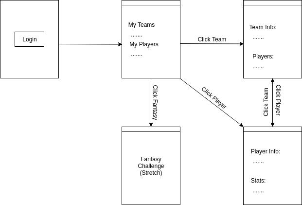
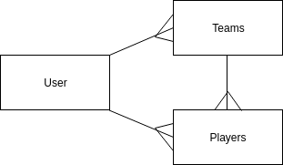

# NCAA Basketball Team Favorites
## 
## Objective:
### - Create an app that allows a user to select favorite teams/players.
##
##
##
## To use the app, click [here](https://college-basketball-project.herokuapp.com/users)
##
##
## Motivation:  
### I've been interested in NCAA basketball since going to my first game while attending college at the University of Kansas.  I've followed the team ever since then, and make a habit of traveling to watch at least two or three games a year in person.
## Prototype View:
### Here is a diagram showing the page model for the app:

### Here is a diagram showing the ERD for the app:

## Technology Implemented:
- JavaScript
- CSS
- HTML
- Git
- Express
- MongoDB
- Node.js
- Heroku

# User Experience:
## User Persona #1:
### Franklin enjoys watching college basketball games.  Franklin wants a convenient way to check up on a list of his favorite teams and favorite players so that he can stay on top of their rankings and statistics.

## User Persona #2:
### Jack loves to play fantasy-type games with his co-workers and wants an app that allows him to quickly check up on how his teams/players are performing.

## Minimum Viable Product:
- AAU, I should be able to log in using Google Authentication.
- AAU, I should be able to view my list of favorite teams and players.
- AAU, I should be able to add/remove teams/players to each of my lists.
- AAU, I should be able to click a player's name on my favorite list and be directed to a page with more information about that player.
- AAU, I should be able to click a team's name on my favorite list and be directed to a page with more information about that team.

## Stretch Goals:
- AAU, I should be able to challenge other users to 'fantasy'-type game based on game data for weekly periods.
- AAU, I should see a list of upcoming games on my calendar.
- AAU, I should be able to see other user's favorite teams/players.

